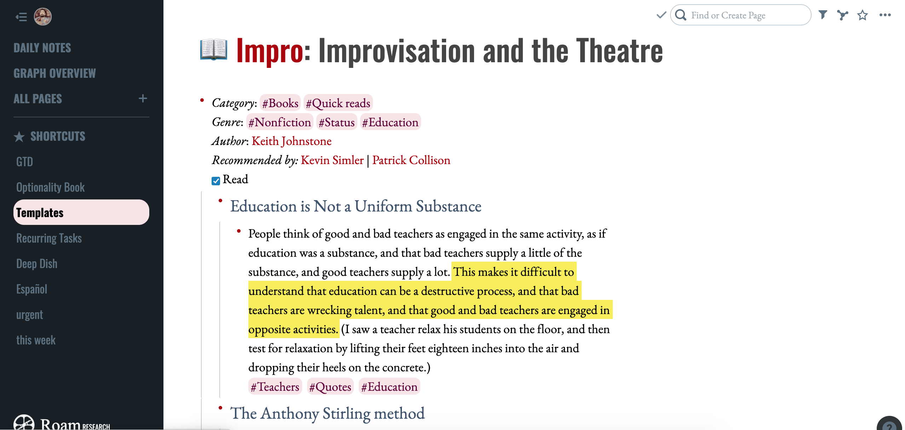

# Magazine CSS theme for Roam Research

For a more visually pleasing writing experience in Roam.

Additions and improvements are welcome, installation instructions below.

# Installation

• If you don't have the Google Fonts on your machine, you'll need to install them locally ([Oswald](https://fonts.google.com/specimen/Oswald) and [EB Garamond](https://fonts.google.com/specimen/EB+Garamond)), or add an import line, or change them to a local font you prefer.

• Download the [Stylus extension](https://chrome.google.com/webstore/detail/stylus/clngdbkpkpeebahjckkjfobafhncgmne?hl=en) for Google Chrome

• Copy-paste the code from the stylesheet into Stylus, and save it as a custom context for Roam Research (or use the equivalent extension for other browsers).

• Check back for updates periodically.

• There are probably smarter ways of doing this but this is what I'm doing.
